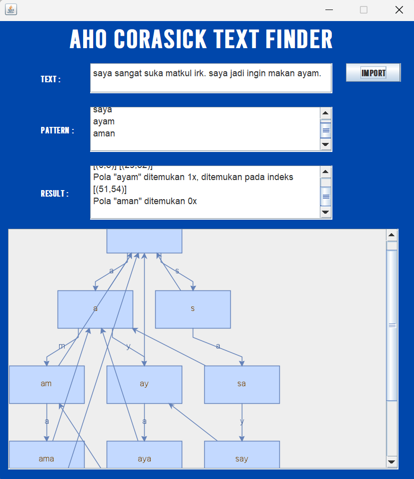

# Aho-Corasick-Text-Finder
## Description
A simple gui simulating the use of Aho-Corasick-Algorithm for String Matching.

## Executing program
1. Run the jar file from main directory
```
java -jar target/TextFinder-1.0-SNAPSHOT.jar
```
  
## Technologies Used
* Java Programming Language
* Maven
* JSON Simple
* JGraphX

## Screenshots
* Main GUI


* Import Dialog


* Output Display


  
## Authors
Ariel Herfrison

## Acknowledgments/References
* [Aho-Corasick-Algorithm](https://www.geeksforgeeks.org/aho-corasick-algorithm-pattern-searching)
* [JSON-Parsing-in-Java](https://www.geeksforgeeks.org/parse-json-java/)
